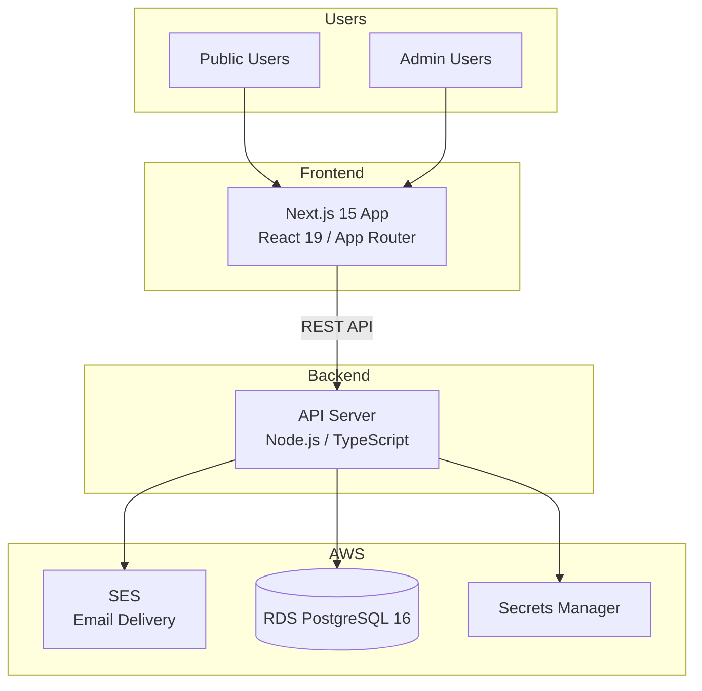
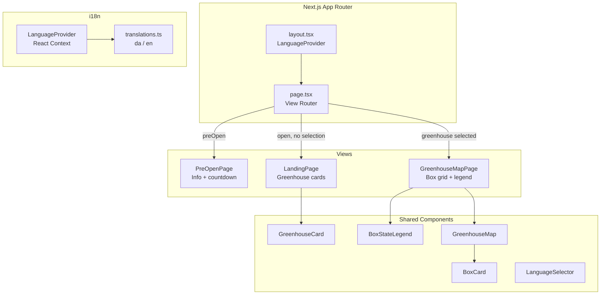
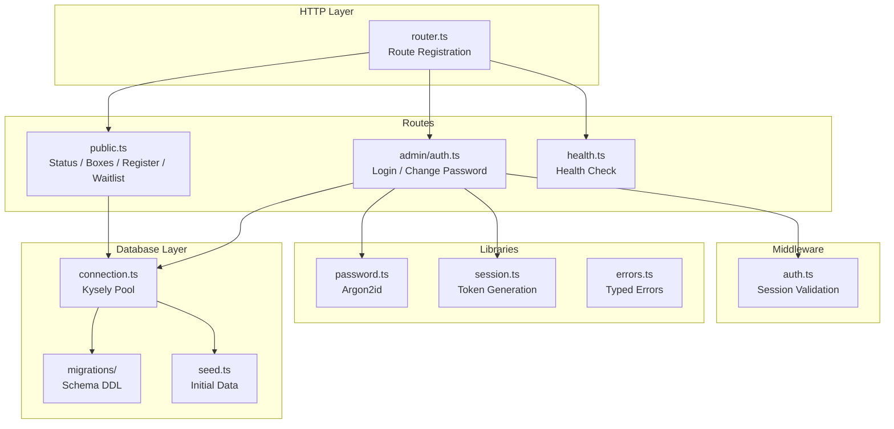
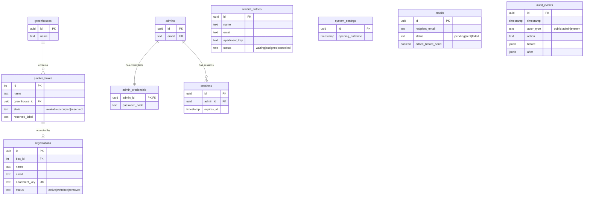
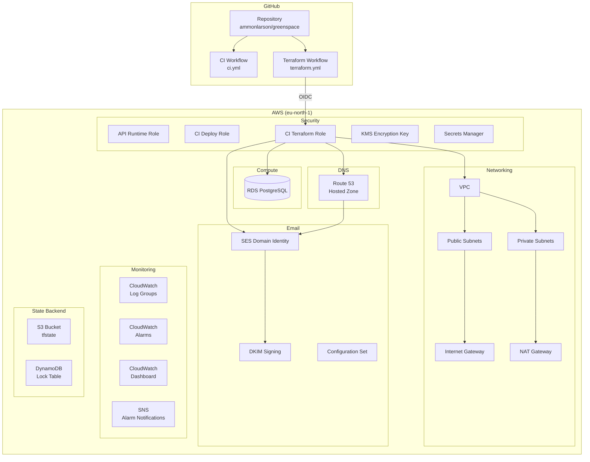
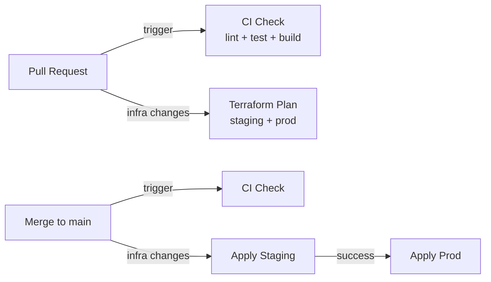

# Greenspace 2026 Architecture

## System Overview

Greenspace is a bilingual (Danish/English) registration platform that allows UN17 residents to register for rooftop planter boxes across two greenhouses. The system serves public users (no authentication) and admin users (email/password authentication).



## Frontend Architecture

The frontend is a Next.js 15 application using the App Router with React 19. It uses inline styles and a custom i18n system based on React context.



### View Routing

The app uses state-driven view switching (not URL routing):

1. **Pre-open mode** — When current time < opening datetime, show `PreOpenPage`.
2. **Landing** — After opening, show `LandingPage` with greenhouse summary cards.
3. **Map view** — When a greenhouse is selected, show `GreenhouseMapPage` with box grid.

### i18n

Language detection follows this priority:
1. Browser locale (`navigator.language`)
2. Manual user selection via `LanguageSelector`

The `LanguageProvider` React context makes the current language and `t()` translation function available to all components. Translation strings are defined in `translations.ts` with key contracts in `@greenspace/shared`.

## Backend Architecture

The API is a Node.js/TypeScript application using Kysely as a type-safe PostgreSQL query builder.



### API Surface

| Method | Path                          | Auth   | Description                        |
|--------|-------------------------------|--------|------------------------------------|
| GET    | `/public/status`              | None   | Registration open/closed status    |
| GET    | `/public/greenhouses`         | None   | Greenhouse summary counts          |
| GET    | `/public/boxes`               | None   | Public-safe box states             |
| POST   | `/public/register`            | None   | Register for a planter box         |
| POST   | `/public/waitlist`            | None   | Join waitlist                      |
| POST   | `/admin/auth/login`           | None   | Admin login                        |
| POST   | `/admin/auth/change-password` | Admin  | Change own password                |
| GET    | `/admin/registrations`        | Admin  | List all registrations             |
| POST   | `/admin/registrations`        | Admin  | Create override reservation        |
| POST   | `/admin/registrations/move`   | Admin  | Move registration between boxes    |
| POST   | `/admin/registrations/remove` | Admin  | Remove registration                |
| POST   | `/admin/waitlist/assign`      | Admin  | Assign waitlist entry to box       |
| PATCH  | `/admin/settings/opening-time`| Admin  | Update opening datetime            |
| POST   | `/admin/admins`               | Admin  | Create admin account               |
| DELETE | `/admin/admins/:id`           | Admin  | Delete admin account               |
| GET    | `/admin/audit`                | Admin  | Retrieve audit timeline            |
| GET    | `/health`                     | None   | Health check                       |

## Database Architecture

PostgreSQL 16 with 10 core tables. Schema is managed via Kysely migrations.



### Key Constraints

- **One active registration per apartment** — Partial unique index on `apartment_key` where `status = 'active'`.
- **One active occupant per box** — Partial unique index on `box_id` where `status = 'active'`.
- **Immutable audit trail** — Database trigger prevents UPDATE/DELETE on `audit_events`.
- **Box states** — Enum constraint: `available`, `occupied`, `reserved`.
- **FIFO waitlist** — Ordered by `created_at`; duplicate apartment preserves earliest timestamp.

## Infrastructure Architecture

All AWS infrastructure is managed via Terraform with isolated staging and production environments.



### Environments

| Environment | Domain                | VPC CIDR       | RDS Instance    |
|-------------|----------------------|----------------|-----------------|
| staging     | `staging.un17hub.com`| `10.0.0.0/16`  | `db.t4g.micro`  |
| prod        | `un17hub.com`        | `10.1.0.0/16`  | `db.t4g.small`  |

### Terraform Module Structure

```
infra/terraform/
├── bootstrap/                 One-time state backend setup
│   ├── main.tf
│   └── variables.tf
├── environments/
│   ├── staging/main.tf        Staging stack configuration
│   └── prod/main.tf           Production stack + subdomain delegation
└── modules/
    └── greenspace_stack/      Shared module for all AWS resources
        ├── main.tf            Naming prefix, provider config
        ├── networking.tf      VPC, subnets, gateways
        ├── iam.tf             IAM roles and policies
        ├── database.tf        RDS, Secrets Manager
        ├── ses.tf             SES identity, DKIM, config set
        ├── dns.tf             Route 53 zone and records
        ├── monitoring.tf      CloudWatch, KMS, Alarms, Dashboard, SNS
        ├── variables.tf       Input variables
        ├── outputs.tf         Module outputs
        └── iam.tftest.hcl     Least-privilege validation tests
```

### CI/CD Pipeline



- **CI** runs on every PR: lint, test, build for all workspaces; `terraform fmt` + `terraform validate`.
- **Terraform** runs when `infra/terraform/**` changes: plan on PRs, apply on merge to main.
- **Drift detection** runs daily via `drift-detection.yml`; creates a GitHub issue if drift is found.
- **Production apply** runs automatically after staging succeeds.
- **AWS auth** uses GitHub OIDC role assumption (no long-lived keys).

## Shared Package

The `@greenspace/shared` package contains code used by both frontend and backend:

- **Domain constants** — Greenhouse names, 29-box catalog, opening datetime, email config.
- **Types** — Interfaces for all entities (`PlanterBoxPublic`, `Registration`, etc.).
- **Validators** — Address, email, name validation with typed results.
- **i18n contracts** — Translation key definitions and language labels.
- **Enums** — Box states, registration statuses, audit actions.
